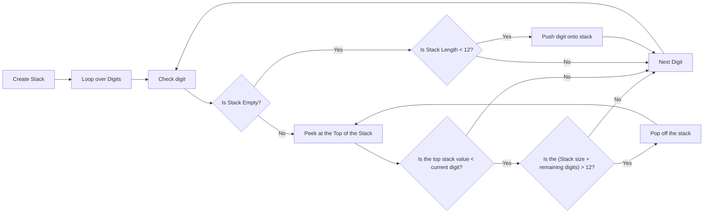

# Day 3: Lobby

**STACKS-A-GO-GO** -- is my unofficial title for this one. At least for part two. Part one was relatively simple, I just found the highest number searching from the left, then found the next highest number starting from that point. I concatenated them together and added them up as per the instructions. That one was easy.

Part two on the other hand required a little more finesse. Specifically with the usage of a Stack. Luckily I just happened to have one up my sleeve already from previous years! I used the `gStack.go` module I created to use this. I call it the `gStack` because it's a generic stack. Previously I wrote an interface as the parameter, but it would force me to write a wrapper around the stack to do any manipulation of the data. Using generics I can specify the datatype during declaration and actually do things with the data rather than code up more wrappers. Kinda happy how that worked out.

Anyways, the logic I had was to use a stack and search from the left to the right. If the stack is empty, push the digit onto the stack. If it's not empty, `Peek()` the stack and compare the value with the digit I'm checking.

I'm so excited with the elegance here that I'm going to create a mermaid diagram to explain the logical steps for each digit! Given the line from the example: `818181911112111`

It looks a little complicated, but if you follow the chart going digit-by-digit from left to right it starts to build the highest possible number by reverse-ordering the stack and concatenating the values into one large value.

This got my brain twisted a bit but once it clicked it all fell into place.